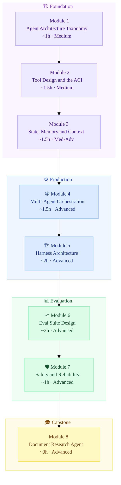

<div align="center">

# 🤖 Agent Harness & Evals
### A Production AI Course for Engineers

[](https://rajeevraibhatia.com/ai-courses/agent-harness-evals)
[](https://github.com/rajeevraibhatia/agent-harness-evals/stargazers)
[](LICENSE)

**From ReAct loops to production eval harnesses.** 8 modules. Medium → Advanced. Interview prep included.

*Part of [AI Courses](https://rajeevraibhatia.com/ai-courses) by [Rajeev Rai Bhatia](https://rajeevraibhatia.com)*

</div>

---

## 🗺️ Roadmap



---

## 📚 Modules

All notebooks use the **OpenAI SDK** (`gpt-4o`) and run standalone in Google Colab — no local setup needed.

| # | Module | Key Concepts | Time | Level | Read | Notebook |
|---|--------|-------------|------|-------|------|----------|
| 1 | **Agent Architecture Taxonomy** | Workflows vs agents, 6 building blocks, ReAct vs Plan-then-Execute, ACI | ~1h | 🟡 Medium | [→ Read](https://rajeevraibhatia.com/ai-courses/agent-harness-evals#module-1) | [](https://colab.research.google.com/github/rajeevraibhatia/agent-harness-evals/blob/main/notebooks/m1_react_loop.ipynb) |
| 2 | **Tool Design & the ACI** | JSON schema design, idempotency, function calling, MCP, tool registry | ~1.5h | 🟡 Medium | [→ Read](https://rajeevraibhatia.com/ai-courses/agent-harness-evals#module-2) | [](https://colab.research.google.com/github/rajeevraibhatia/agent-harness-evals/blob/main/notebooks/m2_tool_registry.ipynb) |
| 3 | **State, Memory & Context Engineering** | 3 memory tiers, context rot, MemoryManager, session handoff | ~1.5h | 🟠 Med-Adv | [→ Read](https://rajeevraibhatia.com/ai-courses/agent-harness-evals#module-3) | [](https://colab.research.google.com/github/rajeevraibhatia/agent-harness-evals/blob/main/notebooks/m3_memory_manager.ipynb) |
| 4 | **Multi-Agent Orchestration Patterns** | Supervisor, debate, swarm, producer-critic, deadlock detection | ~1.5h | 🔴 Advanced | [→ Read](https://rajeevraibhatia.com/ai-courses/agent-harness-evals#module-4) | [](https://colab.research.google.com/github/rajeevraibhatia/agent-harness-evals/blob/main/notebooks/m4_multi_agent.ipynb) |
| 5 | **Harness Architecture** | Initializer/Executor pattern, git as memory, replay log, circuit breakers | ~2h | 🔴 Advanced | [→ Read](https://rajeevraibhatia.com/ai-courses/agent-harness-evals#module-5) | [](https://colab.research.google.com/github/rajeevraibhatia/agent-harness-evals/blob/main/notebooks/m5_harness.ipynb) |
| 6 | **Eval Suite Design** | pass@k vs pass^k, 3 grader types, LLM-as-judge calibration, SWE-Bench | ~2h | 🔴 Advanced | [→ Read](https://rajeevraibhatia.com/ai-courses/agent-harness-evals#module-6) | [](https://colab.research.google.com/github/rajeevraibhatia/agent-harness-evals/blob/main/notebooks/m6_eval_suite.ipynb) |
| 7 | **Safety, Failure Modes & Reliability** | Prompt injection, excessive agency, 6-failure taxonomy, RL on trajectories | ~1h | 🔴 Advanced | [→ Read](https://rajeevraibhatia.com/ai-courses/agent-harness-evals#module-7) | [](https://colab.research.google.com/github/rajeevraibhatia/agent-harness-evals/blob/main/notebooks/m7_safety.ipynb) |
| 8 | **Capstone: Document Research Agent** | End-to-end build — ToolRegistry, MemoryManager, Harness, eval suite | ~3h | 🔴 Advanced | [→ Read](https://rajeevraibhatia.com/ai-courses/agent-harness-evals#module-8) | [](https://colab.research.google.com/github/rajeevraibhatia/agent-harness-evals/blob/main/notebooks/m8_capstone.ipynb) |

---

## 🚀 Quick Start

```bash
pip install openai numpy
export OPENAI_API_KEY="sk-..."
```

Or open any notebook directly in Colab — no local setup needed. Each notebook installs its own dependencies.

---

## 🏗️ What You'll Build

By Module 8 you'll have a working **Document Research Agent**:

```
agent-harness-evals/
├── tool_registry.py      # Schema validation, idempotency gates, error wrapping
├── memory_manager.py     # In-context + episodic + semantic memory tiers
├── harness.py            # Initializer/Executor, replay log, circuit breaker
├── eval_suite.py         # 10-task suite, code + LLM graders, pass@k scoring
└── notebooks/            # One Colab notebook per module
```

**Stretch goal:** run your harness on [GAIA Level 1](https://huggingface.co/datasets/gaia-benchmark/GAIA) tasks and compare to the public leaderboard.

---

## 🎯 Interview Prep

Each module ends with a senior-level system design question. Examples:

> *"What's the difference between a workflow and an agent? Give an example of each for a customer support product."*

> *"Your agent is degrading after turn 20 in production. Walk me through diagnosis and the architectural fix."*

> *"Your coding agent passes 95% of your eval suite. How do you know the evals are measuring the right things?"*

---

## 📄 Research References

| Paper | Authors | Year | Module |
|-------|---------|------|--------|
| [ReAct: Synergizing Reasoning and Acting](https://arxiv.org/abs/2210.03629) | Yao et al. | 2022 | M1 |
| [Tree of Thoughts](https://arxiv.org/abs/2305.10601) | Yao et al. | 2023 | M1 |
| [CodeAct](https://arxiv.org/abs/2402.01030) | Wang et al. | 2024 | M2 |
| [MemGPT](https://arxiv.org/abs/2310.08560) | Packer et al. | 2023 | M3 |
| [Generative Agents](https://arxiv.org/abs/2304.03442) | Park et al. | 2023 | M3 |
| [Multi-Agent Debate](https://arxiv.org/abs/2305.14325) | Du et al. | 2023 | M4 |
| [Indirect Prompt Injection](https://arxiv.org/abs/2302.12173) | Greshake et al. | 2023 | M7 |
| [Let's Verify Step by Step](https://arxiv.org/abs/2305.20050) | Lightman et al. | 2023 | M7 |

---

## 🤝 Contributing

Notebooks are being added module by module. Star the repo to follow along. PRs welcome for:
- Notebook improvements
- Additional exercises
- Bug fixes in code examples

---

<div align="center">

Built by [Rajeev Rai Bhatia](https://rajeevraibhatia.com) · [AI Courses](https://rajeevraibhatia.com/ai-courses) · [LinkedIn](https://www.linkedin.com/in/rajeevraibhatia/)

⭐ **Star this repo** to help other engineers find it

</div>
